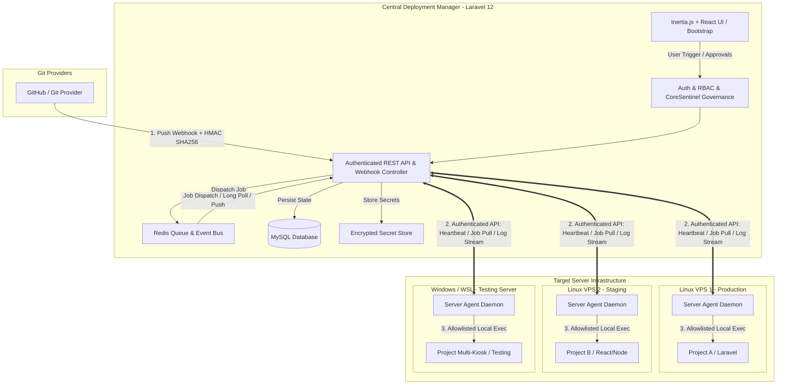
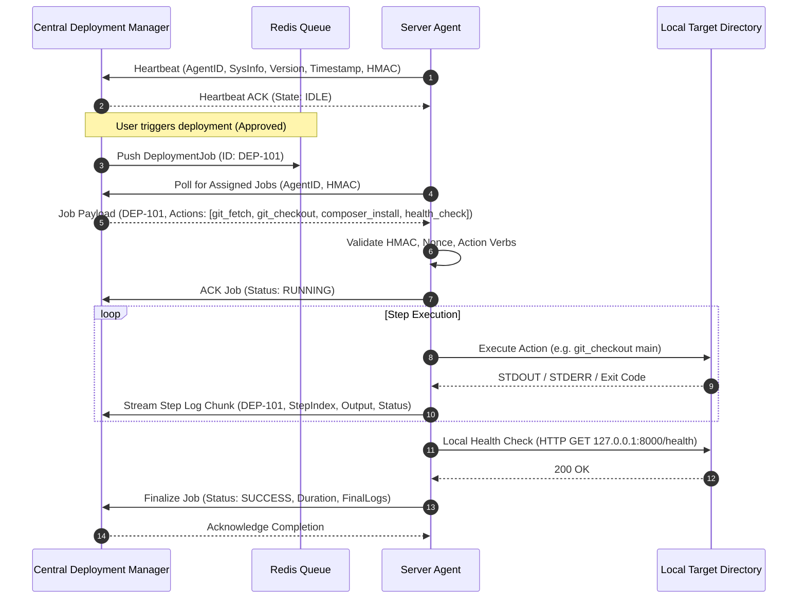
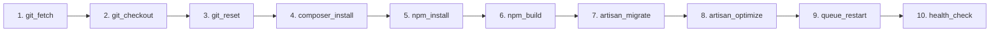
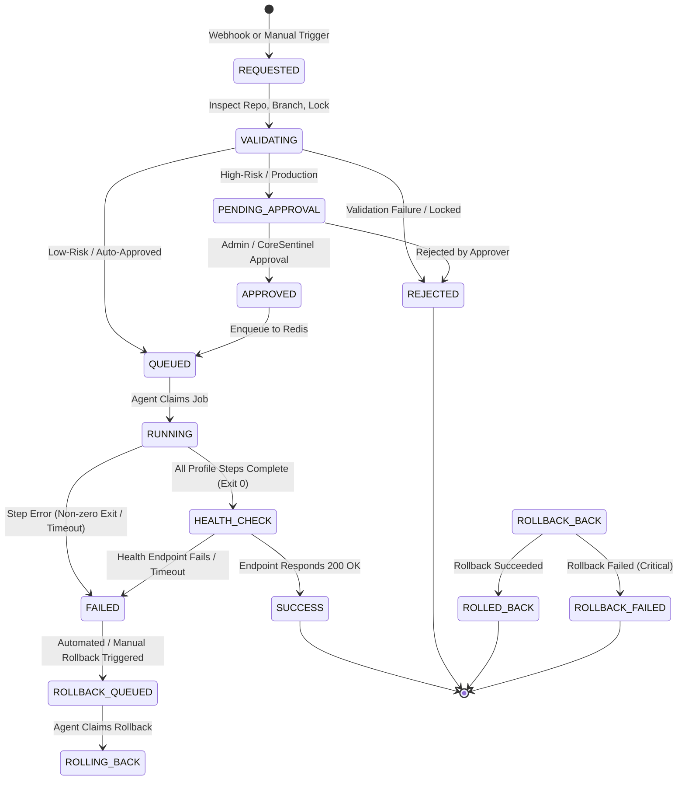
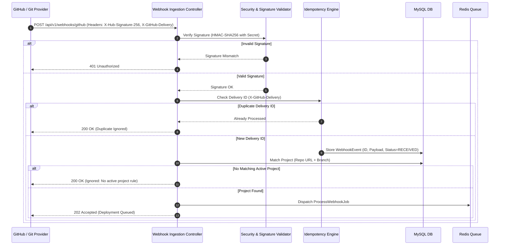
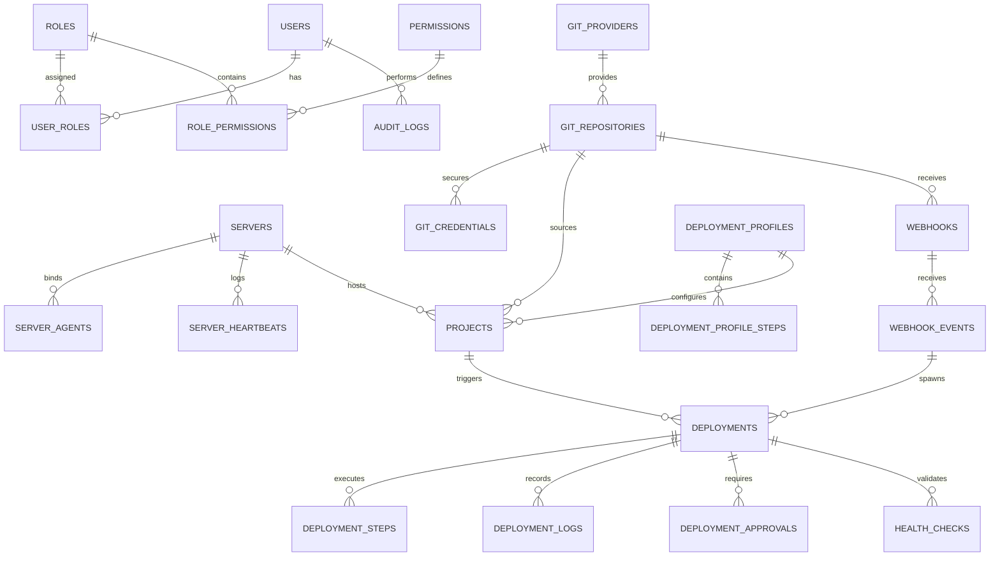

# CoreSentinel Architectural & Implementation Plan
# Project: Git Deployment / Synchronization Manager

---

## 1. Document Metadata

| Field | Value |
| :--- | :--- |
| **Project Name** | CoreSentinel Git Deployment Synchronizer (CS-GDS) |
| **Document Purpose** | Comprehensive architectural specification, security framework, database schema, agent communication protocol, and phased implementation plan for the centralized Git Deployment Manager. |
| **Document Version** | `1.1.0-APPROVED` |
| **Date** | 2026-08-20 |
| **Document Status** | `STATUS: APPROVED — READY FOR PHASE 1 EXECUTION` |
| **Author** | IRIS (Universal Coding Agent) / System Architect |
| **Governance Status** | Approved by Project Lead & System Owner (Fakrul) |
| **Approval Authority** | Fakrul (Project Lead & System Owner) |
| **Target Workspace** | `/Users/wafazztechnology/Desktop/Codex Lure/project/GIT Sync` |

### Change History
| Version | Date | Author | Description of Changes |
| :--- | :--- | :--- | :--- |
| `1.0.0-PLANNING` | 2026-08-20 | IRIS (Architect) | Initial exhaustive system planning document created under CoreSentinel governance. |
| `1.1.0-APPROVED` | 2026-08-20 | Fakrul / IRIS | Formal approval granted by Project Lead (Fakrul); Phase 0 completed and unlocked for Phase 1 execution. |

---

## 2. System Objective & Overview

The **Git Deployment Synchronizer** is a secure, centralized web management platform designed to orchestrate, govern, and audit source code deployment and synchronization from Git repositories (such as GitHub) to distributed target environments (development, testing, staging, and production servers) spanning multiple operating systems (Linux VPS, Windows/WSL, on-premise instances).

### Core Goals
1. **Eliminate Uncontrolled Manual SSH:** Eliminate the requirement for developers and operators to manually SSH into remote servers and execute `git pull`, build scripts, or migrations without oversight.
2. **Agent-Based Architecture:** Utilize lightweight, authenticated local agents running on target servers rather than opening central inbound/outbound SSH access or executing unvalidated remote shell strings.
3. **CoreSentinel Governance:** Implement multi-tier deployment risk gating, mandatory approval checkpoints for production environments, granular RBAC, and strict immutable audit logging.
4. **Idempotent & Traceable Execution:** Prevent duplicate webhook triggers, enforce distributed locks per project-environment pair, and capture structured, sanitized, real-time log telemetry.
5. **Multi-Environment & Multi-Project Support:** Support flexible mapping between private repositories, target branches, servers, and customizable deployment profiles.

---

## 3. Traceability Model Index

To ensure complete audibility across the project lifecycle, every major requirement, architectural decision, security constraint, deployment specification, database entity, user interface view, agent requirement, test case, and operational standard is indexed with a globally unique identifier.

```
┌────────────────────────────────────────────────────────────────────────┐
│                        TRACEABILITY MODEL INDEX                        │
├──────────────┬─────────────────────────────────────────────────────────┤
│ Prefix       │ Domain Scope                                            │
├──────────────┼─────────────────────────────────────────────────────────┤
│ REQ-xxx      │ Core Functional Requirements                            │
│ ADR-xxx      │ Architecture Decision Records                           │
│ SEC-xxx      │ Security & Governance Requirements                      │
│ DEP-xxx      │ Deployment Pipeline & Engine Requirements               │
│ DB-xxx       │ Database Schema & Data Integrity Requirements           │
│ UI-xxx       │ User Interface & Inertia/React Views                    │
│ AGENT-xxx    │ Target Server Agent Protocol & Action Allowlist         │
│ TEST-xxx     │ Quality Assurance & Verification Test Specs             │
│ OPS-xxx      │ Operational, Queue & Observability Specifications       │
│ DEC-xxx      │ Pending Architecture Decision Register                  │
└──────────────┴─────────────────────────────────────────────────────────┘
```

### Traceability Master Cross-Reference Table
| ID | Domain | Category | Description Summary |
| :--- | :--- | :--- | :--- |
| **REQ-001** | Core Functional | Authentication | User authentication, session management, password hashing, optional 2FA. |
| **REQ-002** | Core Functional | RBAC | Role-based authorization and granular permission checks. |
| **REQ-003** | Core Functional | Server Registry | Server inventory, metadata, OS classification, agent bindings. |
| **REQ-004** | Core Functional | Agent Heartbeat | Real-time agent status tracking, connectivity health, version reporting. |
| **REQ-005** | Core Functional | Git Repositories | Repository registration, private repo credentials, webhook endpoints. |
| **REQ-006** | Core Functional | Project Mapping | Association of Repo + Branch + Environment + Server + Profile. |
| **REQ-007** | Core Functional | Deployment Profiles | Configurable, allowlisted step execution sequences. |
| **REQ-008** | Core Functional | Deployment Dispatch | Manual and webhook-triggered deployment execution. |
| **REQ-009** | Core Functional | Webhook Processing | Secure webhook ingestion, signature verification, deduplication. |
| **REQ-010** | Core Functional | Approval Engine | Multi-step approval gates for high-risk and production deployments. |
| **REQ-011** | Core Functional | Logging & Telemetry | Real-time log capture, ANSI sanitization, secret masking. |
| **REQ-012** | Core Functional | Immutable Audit | Comprehensive audit trail for sensitive configuration and deploy events. |
| **REQ-013** | Core Functional | Health Check | Post-deployment automated HTTP/process health verification. |
| **REQ-014** | Core Functional | Rollback Manager | Controlled rollback execution to previous verified deployment state. |
| **ADR-001** | Architecture | Topology | Hub-and-Spoke Agent model over Centralized SSH execution. |
| **ADR-002** | Architecture | Stack Selection | Laravel 12 + React + TypeScript + Inertia.js + Redis + MySQL. |
| **ADR-003** | Architecture | Command Safety | Strict Allowlisted Parameterized Action Model over raw shell strings. |
| **ADR-004** | Architecture | Concurrency | Redis distributed locking per Project-Environment tuple. |
| **ADR-005** | Architecture | Secret Storage | Envelope Encryption (AES-256-GCM) for provider tokens & agent keys. |
| **SEC-001** | Security | Transport | Mandatory TLS 1.3 encryption across web and agent communications. |
| **SEC-002** | Security | Agent Auth | Mutual HMAC/Bearer token authentication with cryptographic rotation. |
| **SEC-003** | Security | Secret Masking | Deterministic regex-based masking of tokens, passwords, and keys in logs. |
| **SEC-004** | Security | Webhook Validation | SHA-256 HMAC signature verification with timing attack mitigation. |
| **SEC-005** | Security | Command Allowlist | Complete rejection of unapproved shell commands (e.g. `rm -rf`, `eval`). |
| **SEC-006** | Security | Replay Protection | Nonce, timestamp verification (<300s drift), and unique event IDs. |
| **DEP-001** | Deployment | Lifecycle | Strict 8-stage state machine from REQUESTED to SUCCESS/FAILED. |
| **DEP-002** | Deployment | Profile Pipeline | Composable step execution engine (fetch, checkout, build, migrate). |
| **DEP-003** | Deployment | Lock Manager | Single-flight deployment enforcement per project-environment. |
| **DEP-004** | Deployment | Rollback Strategy | Release artifact or commit-reversion rollback mechanism. |
| **DB-001** | Database | Schema Design | Normalized 3NF MySQL schema with foreign keys and cascaded soft deletes. |
| **DB-002** | Database | Immutability | Append-only constraints on `deployment_logs` and `audit_logs`. |
| **UI-001** | User Interface | Architecture | Inertia.js + React + TypeScript + Bootstrap responsive layout. |
| **UI-002** | User Interface | Live Console | Real-time SSE/WebSocket deployment log terminal viewer. |
| **AGENT-001**| Agent | Registration | Secure one-time token handshake and public key / secret generation. |
| **AGENT-002**| Agent | Execution | Sandboxed local process execution of allowlisted verbs only. |
| **AGENT-003**| Agent | Telemetry | Chunked log streaming and exit code transmission to manager. |
| **TEST-001** | QA / Testing | Unit Test Suite | Comprehensive unit tests for state machine, signature verification, RBAC. |
| **TEST-002** | QA / Testing | Feature Test Suite| Integration tests for webhook intake, agent dispatch, profile validation. |
| **OPS-001** | Operations | Queue Architecture | Redis queue segregation: `deployments`, `webhooks`, `health-checks`. |
| **OPS-002** | Operations | Rate Limiting | Token bucket rate limiting on webhook ingest and agent polling APIs. |

---

## 4. Architecture & System Topography

### 4.1 Hub-and-Spoke Deployment Architecture



### 4.2 Architectural Decision Records (ADRs)

#### ADR-001: Server Agent Model vs. Centralized Direct SSH
* **Context:** The central management application requires a mechanism to trigger deployments across remote servers (Linux VPS, Windows/WSL, Staging, Production).
* **Decision:** Adopt an **authenticated Server Agent model** over direct SSH from the central Laravel app.
* **Rationale:**
  1. Direct SSH requires the central server to hold elevated SSH private keys for every target server, creating a high-value single point of compromise.
  2. Firewalls, NAT, and Windows/WSL environments often block inbound SSH, whereas outbound HTTP/HTTPS agent communication is reliable and standard.
  3. Direct SSH allows arbitrary shell execution; an agent strictly enforces an allowlisted action model (`git_checkout`, `composer_install`, etc.) and rejects raw user input.
* **Status:** APPROVED AS ARCHITECTURAL BASELINE.

#### ADR-002: Technology Stack Alignment
* **Context:** The stack must provide high developer velocity, robust type safety, real-time interactivity, and enterprise-grade reliability.
* **Decision:**
  * **Backend Framework:** Laravel 12 (PHP 8.2+)
  * **Frontend Architecture:** Inertia.js + React 18+ + TypeScript
  * **Styling & UI:** Bootstrap 5.3 + Responsive Admin Template (Tabler / CoreUI compatible)
  * **Caching & Queue Driver:** Redis 7+
  * **Primary Relational Store:** MySQL 8.0+ / 8.4 LTS
* **Rationale:** Single monolithic Laravel application with Inertia.js eliminates the overhead of separate frontend API routing, maintains strict TypeScript end-to-end typing, and provides robust out-of-the-box queue workers and job isolation via Redis.
* **Status:** APPROVED AS STACK BASELINE.

#### ADR-003: Strict Allowlisted Parameterized Action Engine
* **Context:** Deployment profiles execute commands on target systems (e.g. `composer install`, `php artisan migrate`).
* **Decision:** Agents will NEVER execute unparsed shell strings passed over the network. All operations are structured JSON payloads matching strictly defined verb schemas with validated parameters.
* **Status:** APPROVED AS MANDATORY SECURITY REQUIREMENT.

#### ADR-004: Redis Concurrency & Distributed Lock Architecture
* **Context:** Concurrent deployments to the same target server and environment will cause race conditions, corrupt Git locks, or crash database migrations.
* **Decision:** Implement Redis atomic locks keyed by `lock:deploy:{project_id}:{environment}` with automatic TTL and graceful queue backoff.
* **Status:** APPROVED.

---

## 5. Technology Stack Specification

```
┌────────────────────────────────────────────────────────────────────────┐
│                       FULL TECHNOLOGY STACK                            │
├──────────────────────┬─────────────────────────────────────────────────┤
│ Layer                │ Technology / Specification                      │
├──────────────────────┼─────────────────────────────────────────────────┤
│ Backend Framework    │ Laravel 12.x                                    │
│ Runtime Engine       │ PHP 8.2 / 8.3 / 8.4 Compatible                  │
│ Frontend Architecture│ Inertia.js v2.x (SPA over Server Routing)       │
│ Client Framework     │ React 18.x + TypeScript 5.x                     │
│ UI Framework         │ Bootstrap 5.3.x + Responsive Admin Theme        │
│ Relational Database  │ MySQL 8.0+ / 8.4 LTS (InnoDB, utf8mb4_unicode_ci)│
│ In-Memory / Cache    │ Redis 7.x (Queues, Locks, State, Pub/Sub)       │
│ Package Managers     │ Composer 2.x (PHP), NPM / PNPM (Frontend)       │
│ Process Monitoring   │ Laravel Horizon (Redis Queues)                  │
│ Real-Time Streaming  │ Server-Sent Events (SSE) / Redis Pub/Sub        │
│ Agent Runtime Target │ Go / Rust single binary OR Node/PHP lightweight │
└──────────────────────┴─────────────────────────────────────────────────┘
```

---

## 6. Functional Requirements Specification

### 6.1 Authentication & Session Management (REQ-001)
* **REQ-001.1:** Secure session-based authentication utilizing Laravel Fortify/Breeze patterns (Inertia React).
* **REQ-001.2:** Passwords hashed using `bcrypt` (work factor 12) or `argon2id`.
* **REQ-001.3:** Optional Two-Factor Authentication (TOTP via RFC 6238) with encrypted backup recovery codes.
* **REQ-001.4:** Brute-force rate limiting: 5 failed attempts locks IP/user for 15 minutes with exponential backoff.
* **REQ-001.5:** Explicit account status flags: `active`, `suspended`, `pending_activation`, `deactivated`.

### 6.2 Role-Based Access Control (RBAC) (REQ-002)
* **REQ-002.1:** Granular permissions assigned to roles; users assigned one or more roles.
* **REQ-002.2:** Roles defined:
  1. `Super Admin`: Full system administration, credential management, server provisioning, user roles.
  2. `Admin`: Project, server, and repository management; approval authority.
  3. `Developer`: Create projects, initiate deployments to `development` and `testing`, view logs.
  4. `Deployment Operator`: Trigger deployments across all environments; manage rollback requests.
  5. `Viewer`: Read-only access to dashboards, deployment statuses, and sanitized logs.
  6. `Auditor`: Read-only access to immutable audit logs, compliance reports, and approval records.

#### Granular Permission Matrix
| Permission Name | Super Admin | Admin | Developer | Deployment Operator | Viewer | Auditor |
| :--- | :---: | :---: | :---: | :---: | :---: | :---: |
| `server.view` | ✅ | ✅ | ✅ | ✅ | ✅ | ✅ |
| `server.create` | ✅ | ✅ | ❌ | ❌ | ❌ | ❌ |
| `server.update` | ✅ | ✅ | ❌ | ❌ | ❌ | ❌ |
| `server.delete` | ✅ | ❌ | ❌ | ❌ | ❌ | ❌ |
| `project.view` | ✅ | ✅ | ✅ | ✅ | ✅ | ✅ |
| `project.create` | ✅ | ✅ | ❌ | ❌ | ❌ | ❌ |
| `project.update` | ✅ | ✅ | ❌ | ❌ | ❌ | ❌ |
| `project.delete` | ✅ | ❌ | ❌ | ❌ | ❌ | ❌ |
| `deployment.view` | ✅ | ✅ | ✅ | ✅ | ✅ | ✅ |
| `deployment.create` (Dev/Test) | ✅ | ✅ | ✅ | ✅ | ❌ | ❌ |
| `deployment.create` (Staging) | ✅ | ✅ | ⚠️ Approval | ✅ | ❌ | ❌ |
| `deployment.production` | ✅ | ⚠️ Approval | ❌ | ⚠️ Approval | ❌ | ❌ |
| `deployment.cancel` | ✅ | ✅ | ✅ (Own) | ✅ | ❌ | ❌ |
| `deployment.retry` | ✅ | ✅ | ✅ (Non-prod) | ✅ | ❌ | ❌ |
| `deployment.rollback` | ✅ | ✅ | ❌ | ⚠️ Approval | ❌ | ❌ |
| `approval.view` | ✅ | ✅ | ✅ | ✅ | ❌ | ✅ |
| `approval.approve` | ✅ | ✅ | ❌ | ❌ | ❌ | ❌ |
| `approval.reject` | ✅ | ✅ | ❌ | ❌ | ❌ | ❌ |
| `audit.view` | ✅ | ✅ | ❌ | ❌ | ❌ | ✅ |
| `credential.manage` | ✅ | ❌ | ❌ | ❌ | ❌ | ❌ |

### 6.3 Server Management Module (REQ-003)
* **REQ-003.1:** Registry of target servers supporting environment segregation: `development`, `testing`, `staging`, `production`.
* **REQ-003.2:** Server properties captured: Server Name, Unique Identifier, Operating System (`linux_ubuntu`, `linux_debian`, `linux_rhel`, `windows_wsl`, `windows_native`), Hostname/FQDN (Configurable), Agent Binding ID, IP Binding (Optional/Configurable), Agent Version, Last Heartbeat Timestamp, Status (`online`, `offline`, `degraded`, `maintenance`).
* **REQ-003.3:** Multi-project binding per server with individual directory isolation.

---

## 7. Server Agent Protocol & Action Engine

### 7.1 Agent Operational Principles (AGENT-001)
* **Outbound-Only Communication:** Agents poll the central manager over TLS via long-polling or WebSocket/SSE, or receive cryptographically signed HTTP webhooks if configured in push mode.
* **Mutual Authentication:** Every agent request requires an Agent API Key + HMAC-SHA256 signature calculated over `timestamp + nonce + payload` using an agent-specific shared secret.
* **Strict Parameterized Action Execution:** The agent implements a hardcoded dispatcher. It rejects any action name not present in the allowlist.

### 7.2 Allowlisted Action Registry (AGENT-002)

```
┌────────────────────────────────────────────────────────────────────────┐
│                     AGENT ALLOWLISTED ACTIONS                          │
├────────────────────┬─────────────────────────────┬─────────────────────┤
│ Action Verb        │ Allowed Parameters          │ Safety Constraints  │
├────────────────────┼─────────────────────────────┼─────────────────────┤
│ git_fetch          │ remote, prune (bool)        │ Read-only git fetch │
│ git_checkout       │ branch, commit_sha          │ Validated ref name  │
│ git_reset          │ commit_sha, mode (hard)     │ Restricted to repo  │
│ git_clean          │ force (bool), flags (df)    │ Workspace sandboxed │
│ composer_install   │ no_dev (bool), optimize     │ Timeout 300s        │
│ npm_install        │ frozen_lockfile (bool)      │ CI mode flag only   │
│ npm_build          │ script (build/prod)         │ Must match package  │
│ artisan_migrate    │ force (bool), step (bool)   │ Sandboxed PHP exec  │
│ artisan_optimize   │ clear (bool), cache (bool)  │ Standard artisan    │
│ queue_restart      │ none                        │ Safe process reload │
│ health_check       │ port, path, expected_status │ Local loopback only │
│ rollback_checkout  │ previous_commit_sha         │ Revert to good ref  │
└────────────────────┴─────────────────────────────┴─────────────────────┘
```



---

## 8. Git Repository & Project Management

### 8.1 Repository Registration (REQ-005)
* **Repository Fields:** Display Name, Provider (`github`, `gitlab`, `gitea`, `custom_git`), Repository URL (`https://github.com/org/repo.git`), Default Branch (`main`, `master`), Authentication Type (`github_app`, `personal_access_token`, `deploy_key_ssh`), Credential Reference ID (Vault Key), Webhook Secret (Encrypted), Active Status.
* **Zero Plaintext Storage (SEC-003):** All PATs, Private SSH Keys, and Webhook Secrets are encrypted using AES-256-GCM via Laravel's Encrypter service before MySQL insertion.

### 8.2 Project Mapping Matrix (REQ-006)
A **Project** forms the core operational unit by linking:
```
PROJECT = Repository + Target Branch + Environment + Target Server + Deployment Profile + Working Directory
```

*Example Configuration Model:*
* **Project Name:** Multi-Kiosk Testing
* **Repository:** `REQUIRES USER INPUT` (e.g., `github.com/org/multi-kiosk`)
* **Branch:** `develop` / `main`
* **Environment:** `testing`
* **Target Server:** Windows Testing Server (Agent ID: `agent-win-01`)
* **Working Directory:** `C:\inetpub\wwwroot\multi-kiosk` (Configurable)
* **Deployment Profile:** `Laravel 12 Standard Test Profile`

---

## 9. Deployment Profiles & Pipeline Engine

### 9.1 Profile Definition (DEP-002)
Deployment profiles are modular, reusable recipes defining ordered execution steps.



### 9.2 Profile Step Matrix
| Profile Type | Step Sequence | Environment Target | Failure Policy |
| :--- | :--- | :--- | :--- |
| **Laravel Standard (Dev/Test)** | 1. `git_fetch`<br>2. `git_checkout`<br>3. `git_reset`<br>4. `composer_install`<br>5. `npm_install`<br>6. `npm_build`<br>7. `artisan_migrate`<br>8. `artisan_optimize`<br>9. `health_check` | `development`, `testing` | Abort on error, notify developer. |
| **Laravel Production (Zero-Downtime / Symlink or In-Place)** | 1. `git_fetch`<br>2. `git_checkout`<br>3. `composer_install (--no-dev)`<br>4. `npm_build`<br>5. `artisan_migrate (--force)`<br>6. `artisan_optimize`<br>7. `queue_restart`<br>8. `health_check` | `staging`, `production` | Abort, trigger automated rollback, lock deployment pipeline, trigger high-priority alert. |
| **Static / SPA Build** | 1. `git_fetch`<br>2. `git_checkout`<br>3. `npm_install`<br>4. `npm_build`<br>5. `health_check` | Any | Abort on build failure. |

---

## 10. Deployment State Machine & Workflow Lifecycle

### 10.1 Lifecycle State Transition Diagram (DEP-001)



### 10.2 State Definitions
1. `REQUESTED`: Deployment intent received via API or Webhook.
2. `VALIDATING`: System verifies commit SHA, branch mapping, server availability, and acquires Redis lock.
3. `PENDING_APPROVAL`: Deployment paused awaiting authorized human or CoreSentinel sign-off.
4. `APPROVED`: Sign-off recorded with cryptographic audit hash.
5. `QUEUED`: Job placed onto Redis priority queue.
6. `RUNNING`: Agent actively executing profile steps; streaming logs.
7. `HEALTH_CHECK`: Execution complete; verifying system responsiveness.
8. `SUCCESS`: Deployment verified healthy; lock released.
9. `FAILED`: Execution terminated with error; alerts fired.
10. `ROLLING_BACK`: Previous stable commit or artifact being restored.
11. `ROLLED_BACK`: System restored to previous known good state.

---

## 11. Git Provider Webhook Architecture & Security

### 11.1 Webhook Flow & Ingestion Engine (REQ-009)



### 11.2 Webhook Security Controls (SEC-004, SEC-006)
* **HMAC-SHA256 Verification:** Computed over the raw incoming body bytes using `hash_equals` to prevent timing attacks.
* **Idempotency Guarantee:** Deduplication key created using `hash(provider_event_id + commit_sha + project_id)`. If the hash exists in Redis/MySQL within 24 hours, the request is acknowledged without re-triggering deployment.
* **Branch Filtering:** Webhooks on unmapped branches are discarded immediately after signature verification.

---

## 12. Deployment Logs, Telemetry & Secret Sanitization

### 12.1 Real-Time Streaming Architecture (REQ-011, UI-002)
* **Log Ingestion:** The Server Agent sends log chunks via `POST /api/v1/agent/deployments/{id}/logs` containing `{ step_index, stream: "stdout"|"stderr", chunk: "...", sequence_no: N }`.
* **Broadcast Channel:** Laravel publishes sanitized chunks to Redis Pub/Sub channel `deployment.{id}.logs`.
* **Client Delivery:** Frontend connects via Server-Sent Events (SSE) or WebSockets to stream output into the interactive terminal viewer component.

### 12.2 Secret Sanitization Engine (SEC-003)
Before persisting logs to MySQL or broadcasting over Redis Pub/Sub, the log string passes through a multi-pass regex mask filter:

```
┌────────────────────────────────────────────────────────────────────────┐
│                        SECRET SANITIZATION PATTERNS                    │
├─────────────────────────┬──────────────────────────────────────────────┤
│ Target Secret Type      │ Mask Pattern / Replacement                   │
├─────────────────────────┼──────────────────────────────────────────────┤
│ GitHub PAT / Tokens     │ (ghp_[a-zA-Z0-9]{36}|github_pat_[a-zA-Z0-9_]+)│
│                         │ -> [REDACTED_GITHUB_TOKEN]                   │
│ Generic API Keys        │ ((?:api|access|auth)[_-]key\s*[:=]\s*)['"][^'"]+['"]│
│                         │ -> $1[REDACTED_API_KEY]                      │
│ Private Keys            │ (-----BEGIN [A-Z ]+ PRIVATE KEY-----[^-]+-----END [A-Z ]+ PRIVATE KEY-----)│
│                         │ -> [REDACTED_PRIVATE_KEY]                    │
│ Database Passwords      │ (DB_PASSWORD\s*=\s*)([^\r\n]+)               │
│                         │ -> $1[REDACTED_DB_PASSWORD]                  │
│ Basic Auth in URLs      │ (https?:\/\/)([^:]+):([^@]+)@                │
│                         │ -> $1$2:[REDACTED_AUTH]@                     │
└─────────────────────────┴──────────────────────────────────────────────┘
```

---

## 13. Immutable Audit Trail

### 13.1 Audit Specification (REQ-012, SEC-040)
Every state-changing action generates a structured, append-only record in the `audit_logs` table. Audit logs cannot be updated or deleted through application interfaces.

### 13.2 Audited Event Catalog
* `auth.login.success`, `auth.login.failed`, `auth.logout`, `auth.2fa.verified`
* `server.registered`, `server.updated`, `server.token_rotated`, `server.deleted`
* `agent.registered`, `agent.authenticated`, `agent.revoked`
* `repository.created`, `repository.credentials_updated`, `repository.deleted`
* `project.created`, `project.environment_mapped`, `project.profile_attached`
* `deployment.requested`, `deployment.approved`, `deployment.rejected`, `deployment.started`, `deployment.completed`, `deployment.failed`
* `deployment.rollback_requested`, `deployment.rollback_executed`
* `governance.policy_override`, `governance.incident_triggered`

---

## 14. Rollback Strategy & Risk Assessment

### 14.1 Rollback Methodologies (DEP-004)

```
┌────────────────────────────────────────────────────────────────────────┐
│                      ROLLBACK STRATEGY EVALUATION                      │
├────────────────────────┬─────────────────────┬─────────────────────────┤
│ Strategy               │ Mechanism           │ Risk & Impact Level     │
├────────────────────────┼─────────────────────┼─────────────────────────┤
│ 1. Git Commit Revert   │ `git checkout` to   │ Low risk for code;      │
│    (In-Place)          │ last known good SHA │ HIGH risk for DB schema │
├────────────────────────┼─────────────────────┼─────────────────────────┤
│ 2. Symlink Release Dir │ Atomic switch of    │ Low downtime; requires  │
│    (Capistrano-style)  │ `current` symlink   │ shared storage configs  │
├────────────────────────┼─────────────────────┼─────────────────────────┤
│ 3. Artifact Archive    │ Re-unpack previous  │ Fast; requires local    │
│    Restoration         │ `.tar.gz` bundle    │ artifact storage space  │
└────────────────────────┴─────────────────────┴─────────────────────────┘
```

### 14.2 Multi-Layer Rollback Risk Assessment
* **Laravel Database Migrations:** Rolling back code without rolling back database migrations can cause fatal SQL exceptions (missing columns/tables). Automated down-migrations are hazardous and may drop production data. **Policy: Database rollbacks require explicit manual sign-off and separate review.**
* **User-Uploaded Assets & Storage:** Project storage symlinks (`storage/app/public`) must reside in a persistent shared directory outside release directories to prevent data loss.
* **Environment Configurations (`.env`):** Rollbacks must not overwrite environment variables with obsolete configs.
* **Cache & Queues:** Rollback steps must explicitly execute `artisan optimize:clear` and `artisan queue:restart` to evict stale bytecode and cached serialized jobs.

---

## 15. Conceptual Database Schema & Entity Relationships

### 15.1 Entity Relationship Diagram (DB-001)



### 15.2 Database Table Specifications

#### 1. `users`
* `id` (BIGINT UNSIGNED, PK, Auto Increment)
* `name` (VARCHAR 255)
* `email` (VARCHAR 255, UNIQUE)
* `password` (VARCHAR 255)
* `two_factor_secret` (TEXT, Nullable, Encrypted)
* `two_factor_recovery_codes` (TEXT, Nullable, Encrypted)
* `status` (ENUM: `active`, `suspended`, `pending_activation`, `deactivated`, Default: `active`)
* `remember_token` (VARCHAR 100, Nullable)
* `created_at`, `updated_at` (TIMESTAMP)

#### 2. `roles` & `permissions`
* `roles`: `id`, `name` (VARCHAR 50, UNIQUE), `display_name`, `description`, timestamps.
* `permissions`: `id`, `name` (VARCHAR 100, UNIQUE), `category`, `description`, timestamps.
* `role_permissions`: `role_id` (FK), `permission_id` (FK), PK(`role_id`, `permission_id`).
* `user_roles`: `user_id` (FK), `role_id` (FK), PK(`user_id`, `role_id`).

#### 3. `servers`
* `id` (BIGINT UNSIGNED, PK)
* `uuid` (CHAR 36, UNIQUE)
* `name` (VARCHAR 100)
* `environment` (ENUM: `development`, `testing`, `staging`, `production`)
* `os_type` (ENUM: `linux_ubuntu`, `linux_debian`, `linux_rhel`, `windows_wsl`, `windows_native`, `other`)
* `hostname` (VARCHAR 255, Nullable)
* `ip_address` (VARCHAR 45, Nullable)
* `status` (ENUM: `online`, `offline`, `degraded`, `maintenance`, Default: `offline`)
* `last_heartbeat_at` (TIMESTAMP, Nullable)
* `created_at`, `updated_at`, `deleted_at` (Soft Deletes)

#### 4. `server_agents`
* `id` (BIGINT UNSIGNED, PK)
* `server_id` (BIGINT UNSIGNED, FK -> `servers.id`, UNIQUE)
* `agent_uuid` (CHAR 36, UNIQUE)
* `agent_version` (VARCHAR 30)
* `api_key_hash` (VARCHAR 255)
* `secret_hash` (TEXT, Encrypted)
* `public_key` (TEXT, Nullable)
* `is_active` (BOOLEAN, Default: TRUE)
* `last_ip` (VARCHAR 45, Nullable)
* `created_at`, `updated_at`

#### 5. `server_heartbeats`
* `id` (BIGINT UNSIGNED, PK)
* `server_id` (BIGINT UNSIGNED, FK -> `servers.id`)
* `cpu_usage` (DECIMAL 5,2, Nullable)
* `memory_usage` (DECIMAL 5,2, Nullable)
* `disk_usage` (DECIMAL 5,2, Nullable)
* `reported_version` (VARCHAR 30)
* `recorded_at` (TIMESTAMP)

#### 6. `git_providers` & `git_repositories`
* `git_providers`: `id`, `name` (VARCHAR 50), `provider_type` (`github`, `gitlab`, `custom`), `base_url`, timestamps.
* `git_repositories`: `id`, `provider_id` (FK), `name` (VARCHAR 100), `repo_url` (VARCHAR 500), `owner_org` (VARCHAR 100), `default_branch` (VARCHAR 100), `auth_type` (ENUM: `pat`, `ssh_key`, `github_app`), `credential_id` (FK, Nullable), `is_active` (BOOLEAN), timestamps.

#### 7. `git_credentials`
* `id` (BIGINT UNSIGNED, PK)
* `name` (VARCHAR 100)
* `auth_type` (ENUM: `pat`, `ssh_key`, `token`)
* `encrypted_payload` (LONGTEXT, Encrypted AES-256-GCM)
* `fingerprint` (VARCHAR 100, Nullable)
* `expires_at` (TIMESTAMP, Nullable)
* `created_by` (FK -> `users.id`)
* `created_at`, `updated_at`

#### 8. `projects`
* `id` (BIGINT UNSIGNED, PK)
* `uuid` (CHAR 36, UNIQUE)
* `name` (VARCHAR 100)
* `repository_id` (BIGINT UNSIGNED, FK -> `git_repositories.id`)
* `server_id` (BIGINT UNSIGNED, FK -> `servers.id`)
* `deployment_profile_id` (BIGINT UNSIGNED, FK -> `deployment_profiles.id`)
* `target_branch` (VARCHAR 100)
* `environment` (ENUM: `development`, `testing`, `staging`, `production`)
* `deploy_path` (VARCHAR 500)
* `health_check_url` (VARCHAR 500, Nullable)
* `auto_deploy_on_push` (BOOLEAN, Default: FALSE)
* `requires_approval` (BOOLEAN, Default: TRUE for production)
* `is_locked` (BOOLEAN, Default: FALSE)
* `created_at`, `updated_at`, `deleted_at`

#### 9. `deployment_profiles` & `deployment_profile_steps`
* `deployment_profiles`: `id`, `name`, `framework` (e.g. `laravel12`, `react_spa`), `description`, timestamps.
* `deployment_profile_steps`: `id`, `profile_id` (FK), `step_order` (INT), `action_verb` (VARCHAR 50), `parameters` (JSON), `timeout_seconds` (INT, Default: 300), `allow_failure` (BOOLEAN, Default: FALSE).

#### 10. `deployments`
* `id` (BIGINT UNSIGNED, PK)
* `uuid` (CHAR 36, UNIQUE)
* `project_id` (BIGINT UNSIGNED, FK -> `projects.id`)
* `server_id` (BIGINT UNSIGNED, FK -> `servers.id`)
* `triggered_by_user_id` (BIGINT UNSIGNED, Nullable, FK -> `users.id`)
* `trigger_source` (ENUM: `manual`, `webhook`, `rollback`, `api`)
* `commit_sha` (VARCHAR 40)
* `commit_message` (TEXT, Nullable)
* `commit_author` (VARCHAR 255, Nullable)
* `branch` (VARCHAR 100)
* `status` (ENUM: `requested`, `validating`, `pending_approval`, `approved`, `queued`, `running`, `health_check`, `success`, `failed`, `rolling_back`, `rolled_back`, `cancelled`)
* `started_at` (TIMESTAMP, Nullable)
* `completed_at` (TIMESTAMP, Nullable)
* `duration_seconds` (INT, Nullable)
* `error_summary` (TEXT, Nullable)
* `created_at`, `updated_at`

#### 11. `deployment_steps`
* `id` (BIGINT UNSIGNED, PK)
* `deployment_id` (BIGINT UNSIGNED, FK -> `deployments.id`)
* `step_order` (INT)
* `action_verb` (VARCHAR 50)
* `status` (ENUM: `pending`, `running`, `success`, `failed`, `skipped`)
* `exit_code` (INT, Nullable)
* `started_at` (TIMESTAMP, Nullable)
* `completed_at` (TIMESTAMP, Nullable)
* `created_at`, `updated_at`

#### 12. `deployment_logs`
* `id` (BIGINT UNSIGNED, PK)
* `deployment_id` (BIGINT UNSIGNED, FK -> `deployments.id`)
* `deployment_step_id` (BIGINT UNSIGNED, Nullable, FK -> `deployment_steps.id`)
* `stream_type` (ENUM: `stdout`, `stderr`, `system`)
* `sequence_number` (BIGINT UNSIGNED)
* `log_content` (MEDIUMTEXT)
* `created_at` (TIMESTAMP)

#### 13. `deployment_approvals`
* `id` (BIGINT UNSIGNED, PK)
* `deployment_id` (BIGINT UNSIGNED, FK -> `deployments.id`)
* `requested_by_user_id` (BIGINT UNSIGNED, FK -> `users.id`)
* `assigned_role_id` (BIGINT UNSIGNED, FK -> `roles.id`)
* `approved_by_user_id` (BIGINT UNSIGNED, Nullable, FK -> `users.id`)
* `status` (ENUM: `pending`, `approved`, `rejected`)
* `decision_notes` (TEXT, Nullable)
* `decided_at` (TIMESTAMP, Nullable)
* `created_at`, `updated_at`

#### 14. `webhooks` & `webhook_events`
* `webhooks`: `id`, `uuid`, `repository_id` (FK), `secret_hash` (TEXT, Encrypted), `is_active` (BOOLEAN), timestamps.
* `webhook_events`: `id`, `webhook_id` (FK), `provider_event_id` (VARCHAR 255), `event_type` (VARCHAR 50), `payload` (JSON), `status` (ENUM: `received`, `processed`, `ignored`, `failed`), `ip_address` (VARCHAR 45), timestamps.

#### 15. `health_checks`
* `id` (BIGINT UNSIGNED, PK)
* `deployment_id` (BIGINT UNSIGNED, FK -> `deployments.id`)
* `target_url` (VARCHAR 500)
* `http_status` (INT)
* `response_time_ms` (INT)
* `status` (ENUM: `passed`, `failed`)
* `response_body_snippet` (TEXT, Nullable)
* `checked_at` (TIMESTAMP)

#### 16. `audit_logs`
* `id` (BIGINT UNSIGNED, PK)
* `user_id` (BIGINT UNSIGNED, Nullable, FK -> `users.id`)
* `action` (VARCHAR 100)
* `auditable_type` (VARCHAR 100)
* `auditable_id` (BIGINT UNSIGNED, Nullable)
* `ip_address` (VARCHAR 45)
* `user_agent` (TEXT, Nullable)
* `old_values` (JSON, Nullable)
* `new_values` (JSON, Nullable)
* `created_at` (TIMESTAMP)

---

## 16. Redis Architecture, Queues & Concurrency Locking

### 16.1 Queue Structure (OPS-001)

```
┌────────────────────────────────────────────────────────────────────────┐
│                        REDIS QUEUE TOPOLOGY                            │
├────────────────────┬───────────┬──────────────┬────────────────────────┤
│ Queue Name         │ Priority  │ Max Workers  │ Job Types Handled      │
├────────────────────┼───────────┼──────────────┼────────────────────────┤
│ `deploy-high`      │ 1 (High)  │ 10           │ Production Deploys,    │
│                    │           │              │ Urgent Rollbacks       │
├────────────────────┼───────────┼──────────────┼────────────────────────┤
│ `deployments`      │ 2 (Normal)│ 20           │ Standard Staging/Test  │
│                    │           │              │ Deployments            │
├────────────────────┼───────────┼──────────────┼────────────────────────┤
│ `webhooks`         │ 3 (Fast)  │ 15           │ Inbound Webhook Payload│
│                    │           │              │ Parsing & Verification │
├────────────────────┼───────────┼──────────────┼────────────────────────┤
│ `health-checks`    │ 4 (Async) │ 5            │ Post-deployment probes │
├────────────────────┼───────────┼──────────────┼────────────────────────┤
│ `notifications`    │ 5 (Low)   │ 5            │ Email/Slack Alerts     │
└────────────────────┴───────────┴──────────────┴────────────────────────┘
```

### 16.2 Distributed Locking & Single-Flight Concurrency (ADR-004, DEP-003)
* **Atomic Lock Key:** `lock:deploy:project:{project_id}:env:{environment}`
* **Lock Strategy:** Acquired via Redis `SET key value NX PX 900000` (15-minute maximum TTL with heartbeat extension).
* **Collision Handling:** If a lock exists when a webhook or user requests a deployment, the new request is placed into `PENDING_QUEUE` state or rejected with HTTP 409 Conflict depending on project policy.

---

## 17. Security Architecture & Threat Model

### 17.1 Security Principles (SEC-001 - SEC-006, SEC-050)
1. **Zero Raw Shell Commands:** No user, API call, or webhook can supply arbitrary bash/cmd scripts. Only allowlisted verbs are dispatched.
2. **Mutual Cryptographic Authentication:** Agent communications use signed HMAC tokens.
3. **Defense-in-Depth Secret Isolation:** Tokens and keys stored encrypted; never returned over Inertia responses or raw logs.
4. **Strict RBAC & Least Privilege:** Execution rights segregated by role and environment tier.

### 17.2 Threat Model & Mitigation Matrix

```
┌────────────────────────────────────────────────────────────────────────┐
│                     THREAT MODEL & MITIGATION                          │
├────────────────────────────┬──────────────┬────────────────────────────┤
│ Attack Vector              │ Risk Level   │ Implemented Mitigation     │
├────────────────────────────┼──────────────┼────────────────────────────┤
│ Command Injection          │ Critical     │ Allowlisted parameterized  │
│ via Deployment UI          │              │ action engine (AGENT-002)  │
├────────────────────────────┼──────────────┼────────────────────────────┤
│ Webhook Spoofing / Forgery │ High         │ HMAC-SHA256 signature      │
│                            │              │ check + secret (SEC-004)   │
├────────────────────────────┼──────────────┼────────────────────────────┤
│ Replay Attacks             │ Medium       │ Nonce + Timestamp drift    │
│                            │              │ check <300s (SEC-006)      │
├────────────────────────────┼──────────────┼────────────────────────────┤
│ Rogue Agent Impersonation  │ High         │ Unique Agent UUID + API Key│
│                            │              │ + Secret hash validation   │
├────────────────────────────┼──────────────┼────────────────────────────┤
│ Secret Exposure in Logs    │ High         │ Multi-pattern regex mask   │
│                            │              │ filter engine (SEC-003)    │
├────────────────────────────┼──────────────┼────────────────────────────┤
│ Unauthorized Production    │ Critical     │ Mandatory approval gates + │
│ Deployments                │              │ CoreSentinel gating        │
└────────────────────────────┴──────────────┴────────────────────────────┘
```

---

## 18. CoreSentinel Governance & Risk Tiering

```
┌────────────────────────────────────────────────────────────────────────┐
│                   CORESENTINEL RISK TIERING MATRIX                     │
├─────────────┬───────────────────────────────┬──────────────────────────┤
│ Risk Tier   │ Operations Included           │ Governance Policy        │
├─────────────┼───────────────────────────────┼──────────────────────────┤
│ LOW RISK    │ • View logs & dashboard       │ Automatic execution;     │
│             │ • Agent heartbeat reporting   │ Standard audit log.      │
│             │ • Health check monitoring     │                          │
├─────────────┼───────────────────────────────┼──────────────────────────┤
│ MEDIUM RISK │ • Deploy to Development/Test  │ Automated validation;    │
│             │ • Dependency updates (dev)    │ Rate-limited;            │
│             │ • Non-destructive test migrate│ Developer role required. │
├─────────────┼───────────────────────────────┼──────────────────────────┤
│ HIGH RISK   │ • Production deployment       │ MANDATORY Human Sign-Off │
│             │ • Production DB migration     │ + CoreSentinel Gate      │
│             │ • Rollback execution          │ + Snapshot verification. │
│             │ • Server credential rotation  │                          │
└─────────────┴───────────────────────────────┴──────────────────────────┘
```

*Note:* Where specific automated API gating scripts are external, integration is marked `REQUIRES CORE SENTINEL INTERFACE SPECIFICATION`.

---

## 19. UI/UX Specification (Inertia.js + React + TypeScript)

### 19.1 Frontend Page Hierarchy (UI-001)

```
┌── Dashboard (/dashboard)
│   ├── Online/Offline Server Status Widgets
│   ├── Active & Recent Deployments
│   ├── Pending Production Approvals Queue
│   └── System Health Metrics
│
├── Servers (/servers)
│   ├── Server Inventory & Environment Filtering
│   ├── Server Detail (/servers/{id})
│   │   ├── Hardware / OS / Hostname Info
│   │   ├── Agent Status, Version & Heartbeat Monitor
│   │   └── Hosted Projects & Directory Paths
│   └── Register New Server Modal
│
├── Repositories (/repositories)
│   ├── Registered Repositories List
│   ├── Webhook Configuration & Status
│   └── Register Repository (/repositories/create)
│
├── Projects (/projects)
│   ├── Project Directory & Environment Matrix
│   ├── Project Detail (/projects/{id})
│   │   ├── Repo & Branch Mapping
│   │   ├── Assigned Target Server & Deploy Profile
│   │   └── Deployment Trigger Console
│   └── Create / Edit Project
│
├── Deployment Profiles (/profiles)
│   ├── Profile Recipe Builder (Step reordering & parameter forms)
│   └── Profile Templates (Laravel 12, Node/React, Custom)
│
├── Deployments (/deployments)
│   ├── Historical Deployment Table (Filter by Project, Server, Status)
│   └── Live Deployment View (/deployments/{id})
│       ├── Real-time Step Progress Stepper
│       ├── Live Streaming Terminal Log (ANSI color support)
│       ├── Health Check Verification Card
│       └── Rollback & Retry Action Toolbar
│
├── Approvals (/approvals)
│   └── Pending Production Sign-Off Queue (Diff review, Authorize/Reject)
│
├── Audit Logs (/audit-logs)
│   └── Immutable Audit Search & Filter Table
│
└── Settings & Users (/settings)
    ├── User Management & RBAC Role Assignment
    ├── System Health & Redis Queue Horizon Monitor
    └── CoreSentinel Governance Configuration
```

### 19.2 Responsive Design Standards
* **Breakpoints:** Optimized for Mobile (`<768px`), Tablet (`768px - 1024px`), and Desktop (`>1024px`).
* **Design Kit:** Bootstrap 5.3 utilities with a dark/light mode toggle and responsive data tables with pagination and column toggles.

---

## 20. API Design Specification

### 20.1 Server Agent API Endpoints

```
┌────────────────────────────────────────────────────────────────────────┐
│                        AGENT REST API CONTRACT                         │
├────────────────────┬───────────────────────────────────────────────────┤
│ Endpoint           │ Purpose & Protocol                                │
├────────────────────┼───────────────────────────────────────────────────┤
│ `POST /api/v1/agent/register`                                          │
│ Handshake & Token  │ Initial registration using one-time token. Returns│
│ Exchange           │ `agent_uuid` and cryptographic shared secret.     │
├────────────────────┼───────────────────────────────────────────────────┤
│ `POST /api/v1/agent/heartbeat`                                         │
│ Telemetry & Ping   │ Sends CPU, memory, disk, and agent version.       │
│                    │ Returns ACK and pending job indicator.            │
├────────────────────┼───────────────────────────────────────────────────┤
│ `GET /api/v1/agent/jobs/poll`                                          │
│ Job Acquisition    │ Agent long-polls for next assigned deployment.    │
│                    │ Returns structured job JSON with step allowlist.  │
├────────────────────┼───────────────────────────────────────────────────┤
│ `POST /api/v1/agent/deployments/{id}/ack`                             │
│ Job Acknowledgment │ Agent confirms job receipt and transition to      │
│                    │ `RUNNING`.                                        │
├────────────────────┼───────────────────────────────────────────────────┤
│ `POST /api/v1/agent/deployments/{id}/logs`                             │
│ Chunked Log Stream │ Agent streams real-time stdout/stderr chunks.     │
├────────────────────┼───────────────────────────────────────────────────┤
│ `POST /api/v1/agent/deployments/{id}/complete`                         │
│ Final Status       │ Submits exit status, step durations, and status.  │
└────────────────────┴───────────────────────────────────────────────────┘
```

### 20.2 Git Webhook Endpoint
* **Endpoint:** `POST /api/v1/webhooks/github`
* **Headers Required:** `X-Hub-Signature-256`, `X-GitHub-Event`, `X-GitHub-Delivery`
* **Response Contract:**
  * `202 Accepted` -> Webhook valid, deployment queued.
  * `200 OK` -> Webhook valid, event ignored (unmonitored branch / duplicate).
  * `401 Unauthorized` -> Signature verification failed.

---

## 21. Failure Handling & Resilience Matrix

```
┌────────────────────────────────────────────────────────────────────────┐
│                     FAILURE RECOVERY MATRIX                            │
├────────────────────────┬───────────────────────────────────────────────┤
│ Failure Scenario       │ Deterministic Recovery Behavior               │
├────────────────────────┼───────────────────────────────────────────────┤
│ Git Provider Offline   │ Mark deployment `FAILED`, log network error,  │
│ or Repo Unreachable    │ release Redis lock, send retry prompt.        │
├────────────────────────┼───────────────────────────────────────────────┤
│ Agent Offline during   │ Timeout after 120s without heartbeat; mark    │
│ Dispatch               │ deployment `FAILED`; trigger operator alert.  │
├────────────────────────┼───────────────────────────────────────────────┤
│ Composer / NPM Build   │ Terminate pipeline immediately; capture       │
│ Process Error          │ STDERR into logs; mark `FAILED`; no migrate.  │
├────────────────────────┼───────────────────────────────────────────────┤
│ Artisan Migration      │ Pipeline halted; flag as `CRITICAL_MIGRATION_ │
│ Failure                │ ERROR`; prevent automatic rollback without DB │
│                        │ review; notify Admin immediately.             │
├────────────────────────┼───────────────────────────────────────────────┤
│ Post-Deployment        │ Retry probe 3 times (5s delay); if still fail,│
│ Health Check Failure   │ flag `HEALTH_CHECK_FAILED`; trigger rollback  │
│                        │ recommendation.                               │
├────────────────────────┼───────────────────────────────────────────────┤
│ Redis Connection Drop  │ Application falls back to synchronous DB lock;│
│                        │ retries connection with backoff.              │
└────────────────────────┴───────────────────────────────────────────────┘
```

---

## 22. Backup, Disaster Recovery & Secrets Strategy

### 22.1 Backup Scope (OPS-003)
* **Application Database (MySQL):** Scheduled daily automated encrypted `mysqldump` / binary log replication.
* **Encrypted Secrets & Credentials:** Encryption keys (`APP_KEY`) backed up into air-gapped secure vault storage.
* **Audit Trail Archival:** Monthly partitioned archive of `audit_logs` and `deployment_logs`.

### 22.2 Secret Security Standard (SEC-003, SEC-005)
* Zero hardcoded credentials in codebase, migrations, or `Planning.md`.
* Master key managed via environment variable (`APP_KEY`).
* Secrets masked in all UI responses and log persistence layers.

---

## 23. Quality Assurance & Verification Test Strategy

```
┌────────────────────────────────────────────────────────────────────────┐
│                        COMPREHENSIVE TEST SUITE                        │
├─────────────────┬──────────────────────────────────────────────────────┤
│ Test Category   │ Key Target Test Scenarios                            │
├─────────────────┼──────────────────────────────────────────────────────┤
│ Unit Tests      │ • Deployment State Machine transition validity       │
│ (TEST-001)      │ • HMAC-SHA256 webhook signature calculator           │
│                 │ • Log sanitizer regex masking accuracy               │
│                 │ • RBAC permission gate evaluation                    │
│                 │ • Idempotency key generation & collision checks      │
├─────────────────┼──────────────────────────────────────────────────────┤
│ Feature Tests   │ • Server registration and API key hashing            │
│ (TEST-002)      │ • Project creation with valid server/repo relations  │
│                 │ • Manual deployment request workflow                 │
│                 │ • Production approval gate approval & rejection      │
│                 │ • Webhook ingestion and branch filtering             │
├─────────────────┼──────────────────────────────────────────────────────┤
│ Agent Tests     │ • Agent handshake and secret rotation                │
│ (TEST-003)      │ • Rejection of non-allowlisted shell commands        │
│                 │ • Heartbeat reporting and telemetry recording        │
│                 │ • Controlled execution of allowlisted verbs          │
├─────────────────┼──────────────────────────────────────────────────────┤
│ Security Tests  │ • Timing attack resistance on webhook verification   │
│ (TEST-004)      │ • Attempted RBAC bypass on production endpoints      │
│                 │ • Injection of malicious payloads into log streaming │
│                 │ • Replay attack rejection via nonce/timestamp check  │
└─────────────────┴──────────────────────────────────────────────────────┘
```

---

## 24. Implementation Roadmap & Phased Execution Plan

```
Phase 0: Architecture & Protocol Approval (CURRENT)
   ↓
Phase 1: Laravel 12 & Inertia React Foundation Setup
   ↓
Phase 2: Authentication, Security & RBAC Engine
   ↓
Phase 3: Server Registry & Agent Communication Protocol
   ↓
Phase 4: Git Repository & Project Mapping Engine
   ↓
Phase 5: Deployment Profiles & Execution Pipeline
   ↓
Phase 6: GitHub Webhook Ingestion & Deduplication
   ↓
Phase 7: Live Log Streaming, Sanitization & Audit Engine
   ↓
Phase 8: Production Approval Gate & CoreSentinel Governance
   ↓
Phase 9: Health Checks, Rollback Manager & Resilience
   ↓
Phase 10: System Hardening, Load Testing & Verification
```

### Phase Details

#### Phase 0: Architecture & Protocol Approval
* **Objective:** Establish formal system blueprint, traceability matrix, and governance approval.
* **Deliverable:** `Planning.md`.
* **Gate:** Explicit user approval required (`APPROVED — EXECUTE`).

#### Phase 1: Laravel 12 & Inertia React Foundation
* **Objective:** Initialize Laravel 12 application skeleton with Inertia.js, React, TypeScript, and Bootstrap admin layout.
* **Dependencies:** Phase 0 approval.
* **Deliverables:** Working SPA foundation, basic layout navigation, MySQL database connectivity.

#### Phase 2: Authentication, Security & RBAC Engine
* **Objective:** Implement user authentication, Fortify session security, roles, and granular permissions.
* **Dependencies:** Phase 1.
* **Deliverables:** Login/Logout, 2FA support, RBAC middleware, user management interface.

#### Phase 3: Server Registry & Agent Communication Protocol
* **Objective:** Build server inventory management and authenticated REST API for Server Agents.
* **Dependencies:** Phase 2.
* **Deliverables:** Server CRUD, Agent registration handshake, heartbeat monitor, agent daemon prototype.

#### Phase 4: Git Repository & Project Mapping Engine
* **Objective:** Create secure credential vault, repository registration, and project mapping matrix.
* **Dependencies:** Phase 3.
* **Deliverables:** Repository management UI, encrypted PAT/SSH key storage, Project configuration UI.

#### Phase 5: Deployment Profiles & Execution Pipeline
* **Objective:** Implement modular deployment profile builder, Redis queue workers, and execution state machine.
* **Dependencies:** Phase 4.
* **Deliverables:** Profile recipe builder, queue dispatchers, agent execution runner.

#### Phase 6: GitHub Webhook Ingestion & Deduplication
* **Objective:** Build webhook controller with HMAC-SHA256 verification, delivery deduplication, and auto-dispatch.
* **Dependencies:** Phase 5.
* **Deliverables:** Webhook endpoint, delivery logs, automated deployment triggers.

#### Phase 7: Live Log Streaming, Sanitization & Audit Engine
* **Objective:** Implement real-time log ingestion, regex secret masking, SSE/WebSocket terminal viewer, and immutable audit logs.
* **Dependencies:** Phase 6.
* **Deliverables:** Live console UI, sanitizer filter, immutable audit trail.

#### Phase 8: Production Approval Gate & CoreSentinel Governance
* **Objective:** Enforce multi-tier risk approval workflows for production deployments.
* **Dependencies:** Phase 7.
* **Deliverables:** Approval dashboard, notification alerts, CoreSentinel policy checks.

#### Phase 9: Health Checks, Rollback Manager & Resilience
* **Objective:** Implement post-deploy automated HTTP probes and single-click / automated rollback engine.
* **Dependencies:** Phase 8.
* **Deliverables:** Health check monitors, rollback orchestrator, failure recovery handlers.

#### Phase 10: System Hardening, Load Testing & Verification
* **Objective:** Perform end-to-end integration tests, security audit, and 6-point CoreSentinel verification.
* **Dependencies:** Phase 9.
* **Deliverables:** Full test suite execution (`coresentinel verify`), deployment documentation.

---

## 25. Risk Register

| Risk ID | Risk Description | Severity | Probability | Mitigation Strategy |
| :--- | :--- | :---: | :---: | :--- |
| **RSK-001** | Unauthorized deployment trigger | Critical | TBD | Strict RBAC + Mandatory production approval gates. |
| **RSK-002** | Arbitrary shell command execution | Critical | TBD | Strict allowlisted parameterized action engine (AGENT-002). |
| **RSK-003** | Provider token / Private key leakage | Critical | TBD | AES-256-GCM encryption at rest + regex log sanitization. |
| **RSK-004** | Duplicate webhook deployment races | High | TBD | Idempotency engine + Redis distributed mutex locking. |
| **RSK-005** | Production database migration failure | Critical | TBD | Manual approval required for migrations; automated backup checkpoint. |
| **RSK-006** | Rogue or compromised server agent | Critical | TBD | Unique agent UUID + HMAC signature verification + IP restriction. |
| **RSK-007** | Partial / Corrupted deployment | High | TBD | Atomic release directories or automated rollback checkout. |
| **RSK-008** | Inbound network block to target servers | Medium | TBD | Outbound-only agent polling model (ADR-001). |
| **RSK-009** | Rate limiting / abuse on webhook APIs | Medium | TBD | Token bucket rate limiting + signature verification drop. |

---

## 26. Architecture Decision & Pending Register

* **DEC-001: Agent Daemon Technology:** Choice between Go binary (cross-platform, standalone), Node.js, or lightweight PHP CLI script. `[REQUIRES USER INPUT]`
* **DEC-002: GitHub App vs. Personal Access Token (PAT):** Determine preferred primary GitHub integration model for repository cloning. `[REQUIRES USER INPUT]`
* **DEC-003: Zero-Downtime Symlink Deployment vs. In-Place Git Checkout:** Evaluate whether production targets require symlink release switching or direct working tree checkout. `[REQUIRES USER INPUT]`
* **DEC-004: Production Approver Quorum:** Single admin sign-off vs. multi-approver requirement. `[REQUIRES USER INPUT]`
* **DEC-005: CoreSentinel Webhook / API Integration Endpoint:** Specification of external CoreSentinel verification hooks. `[REQUIRES CORE SENTINEL INTERFACE SPECIFICATION]`

---

## 27. System Acceptance Criteria

1. **Agent Authentication:** Registered server agent successfully authenticates using HMAC-SHA256 and reports regular heartbeats.
2. **Credential Security:** Git provider credentials (PAT / SSH Keys) are encrypted at rest; zero plaintext secrets visible in database or UI.
3. **Controlled Command Model:** The agent strictly rejects unapproved shell commands (e.g. `rm -rf`, arbitrary bash).
4. **Idempotent Webhooks:** Duplicate GitHub webhook deliveries (`X-GitHub-Delivery`) trigger only one deployment.
5. **Approval Enforcement:** Deployments targeted at `production` halt in `PENDING_APPROVAL` state and cannot execute without an authorized user's cryptographic sign-off.
6. **Real-Time Sanitized Telemetry:** Deployment logs stream in real-time to the web console with passwords and tokens masked.
7. **Traceability:** Every deployment is auditable to its triggering user/webhook, commit SHA, branch, server, exit status, and execution duration.
8. **Concurrency Safety:** Concurrent deployments to the same project-environment pair are queued or rejected safely via Redis locking.

---

## 28. Explicit Unknown Information & "REQUIRES USER INPUT"

The following parameters are unassumed and require explicit specification prior to system execution:

* **GitHub Organization / Account Details:** `REQUIRES USER INPUT`
* **Target Git Repository URLs & Branches:** `REQUIRES USER INPUT`
* **Target Server Hostnames, Operating Systems & IP Addresses:** `REQUIRES USER INPUT`
* **Windows / WSL Specific Path Conventions:** `REQUIRES USER INPUT`
* **Domain Names & SSL / TLS Termination Setup:** `REQUIRES USER INPUT`
* **Email / Notification Webhook Providers (Slack/Discord/SMTP):** `REQUIRES USER INPUT`
* **Production Deployment Approval Authority Roster:** `REQUIRES USER INPUT`
* **CoreSentinel Interface Specification:** `REQUIRES CORE SENTINEL INTERFACE SPECIFICATION`

---

## 29. EXECUTION GATE

```
## EXECUTION GATE
STATUS: UNLOCKED / APPROVED (PHASE 0 COMPLETED)
Approval Authority: Fakrul (Project Lead & System Owner)
Approval Timestamp: 2026-08-20
Phase 0 (System Architecture & Planning) has been formally reviewed and APPROVED.
The project is authorized to proceed to Phase 1 (Laravel 12 & Inertia React Foundation Setup).
```
